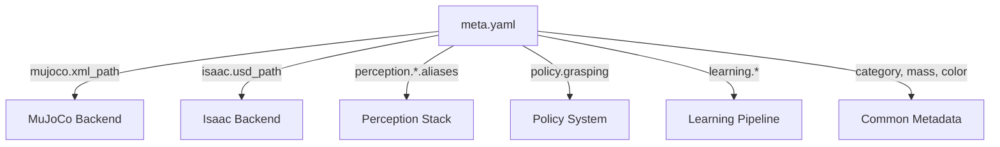

# 🧠 Asset Manager
*Describe once, use everywhere — a shared registry for robotic assets across perception, simulation, and learning.*

Robotics projects often need to reuse the same physical assets — like cups, plates, and tools — across **multiple simulators, perception pipelines, and learning policies**.  
Managing these assets in each system separately leads to duplication, inconsistent metadata, and synchronization errors.

The **Asset Manager** provides a single source of truth for all object definitions, simulator-specific files, and perception aliases.

---

## 🎯 Motivation

| Challenge | Solution |
|------------|-----------|
| MuJoCo, Isaac, and Perception each store their own asset definitions | Use a single YAML registry to describe every object once |
| Each simulator needs paths, colors, or scaling in different formats | Define them under namespaced sections (`mujoco:`, `isaac:`, etc.) |
| Perception may call the same object by multiple names | Add module-specific aliases under `perception:` |
| Policy and learning systems need object-specific metadata | Extensible module system supports `policy:`, `learning:`, `safety:`, etc. |

---

## 🧩 Design Principles

1. **YAML-first** — all data stored as simple text files, easily versioned in Git.  
2. **Simulator-agnostic** — supports any backend (`mujoco`, `isaac`, `ros`, `gazebo`, `urdf`).  
3. **Module extensibility** — new keys (like `policy`, `rendering`, `learning`, etc.) can be added freely.  
4. **Immutable schema, flexible semantics** — top-level fields are human-readable and directly parsed.  
5. **Minimal dependencies** — just `PyYAML`.

---

## ⚙️ Example Schema (`meta.yaml`)

Here's a comprehensive example showing the full power of the Asset Manager:

```yaml
name: cup
category: [kitchenware, container, fragile]
mass: 0.15
dimensions: [0.08, 0.08, 0.12]
color: [0.8, 0.2, 0.2]
material: ceramic

# Simulator-specific configurations
mujoco:
  xml_path: mujoco_cup.xml
  scale: 1.0
  damping: [0.1, 0.1, 0.1]
isaac:
  usd_path: cup.usd
  physics_material: ceramic
  collision_group: -1

# Multiple perception modules with aliases
perception:
  ycb:
    aliases: ["mug", "cup001", "red cup", "drinking cup"]
    id: 42
  coco:
    aliases: ["cup", "mug", "coffee cup"]
    category_id: 47
  custom_detector:
    aliases: ["red_cup_v2", "cup_small"]
    confidence_threshold: 0.85

# Policy and manipulation metadata
policy:
  grasping:
    affordances: [lift, pour]
    preferred_grasp_type: top_down
    difficulty: medium
  manipulation:
    stable_poses: [upright, sideways]

# Rendering configuration (optional)
rendering:
  textures:
    label_path: textures/cup_label.png
  lighting:
    subsurface_scattering: false
```

---

## 🚀 Quickstart

```bash
# Initialize project (if using uv)
uv sync

# Run the comprehensive demo
PYTHONPATH=src uv run demos/full_capabilities.py
```

Example output:
```
[AssetManager] Indexed 7 assets from data/objects

========== SUMMARY ==========
[AssetManager] Loaded 7 assets from data/objects
  - bottle     | container, kitchenware, recyclable | MJ: mujoco_bottle.xml | Isaac: bottle.usd
  - bowl       | kitchenware, container | MJ: mujoco_bowl.xml | Isaac: bowl.usd
  - box        | container, storage, manipulable | MJ: mujoco_box.xml  | Isaac: box.usd
  - cup        | kitchenware, container, fragile | MJ: mujoco_cup.xml  | Isaac: cup.usd
  - fork       | utensil, tool, metal | MJ: mujoco_fork.xml | Isaac: fork.usd
  - knife      | utensil, sharp_object, tool | MJ: mujoco_knife.xml | Isaac: knife.usd
  - plate      | kitchenware, container, stable | MJ: mujoco_plate.xml | Isaac: plate.usd

========== MODULES ==========
['geometric_properties', 'isaac', 'learning', 'mujoco', 'perception', 
 'perception:coco', 'perception:custom_detector', 'perception:depth_estimation', 
 'perception:occluded_detection', 'perception:ycb', 'policy', 'rendering', 'safety']
```

---

## 🧠 Example Queries

```python
from asset_manager.manager import AssetManager

am = AssetManager("data/objects", validate_files=False)

# List all assets
print(am.list())
# ['bottle', 'bowl', 'box', 'cup', 'fork', 'knife', 'plate']

# Filter by category
print(am.by_category("kitchenware"))
# ['cup', 'plate', 'bowl', 'bottle']

# Get simulator-specific file path
print(am.get_path("cup", "mujoco"))
# /path/to/data/objects/cup/mujoco_cup.xml

# Resolve perception alias across multiple modules
print(am.resolve_alias("red cup", module="ycb"))  # → cup
print(am.resolve_alias("mug", module="coco"))      # → cup

# Get full asset metadata
cup_meta = am.get("cup")
print(cup_meta["policy"]["grasping"]["affordances"])
# ['lift', 'pour']

# Discover available modules
print(am.modules())
# ['geometric_properties', 'isaac', 'learning', 'mujoco', 'perception', ...]
```

---

## 🏗️ Supported Modules

The Asset Manager supports extensible modules for different use cases:

| Module | Purpose | Example Use Case |
|---------|---------|------------------|
| **mujoco** | MuJoCo simulator config | Physics properties, XML paths, friction, damping |
| **isaac** | Isaac Sim config | USD paths, physics materials, collision groups, rendering |
| **perception** | Perception pipeline integration | Multi-module alias resolution (YCB, COCO, custom detectors) |
| **policy** | Grasping and manipulation | Affordances, grasp types, difficulty, stable poses |
| **learning** | ML/RL training metadata | Dataset sources, training configurations, success rates |
| **safety** | Safety constraints | Sharp objects, handling requirements |
| **rendering** | Visualization config | Textures, lighting, material properties |
| **geometric_properties** | Shape metadata | Dimensions, volumes, structural properties |

---

## 🧩 Architecture Diagram



---

## 📦 Directory Layout

```
asset_manager/
├── src/
│   └── asset_manager/
│       └── manager.py
├── data/
│   └── objects/
│       ├── cup/
│       │   ├── meta.yaml
│       │   └── mujoco_cup.xml
│       ├── bowl/
│       ├── plate/
│       ├── knife/
│       ├── bottle/
│       ├── fork/
│       └── box/
└── demos/
    └── full_capabilities.py
```

---

## 🔍 Key Features

- ✅ **Multi-module perception support** — resolve aliases across YCB, COCO, and custom detectors
- ✅ **Simulator-agnostic** — unified interface for MuJoCo, Isaac, and future simulators
- ✅ **Policy integration** — store grasping affordances, manipulation constraints, and task-specific data
- ✅ **Learning metadata** — track training data sources, augmentation, and policy performance
- ✅ **Safety annotations** — mark sharp objects, handling requirements, and caution flags
- ✅ **Rich metadata** — dimensions, materials, colors, and geometric properties
- ✅ **Category filtering** — query assets by one or more categories
- ✅ **YAML export** — export subsets of assets for integration with other tools

---

## 🧑‍💻 Authors

Developed by **Siddhartha Srinivasa**  
Personal Robotics Lab, University of Washington
