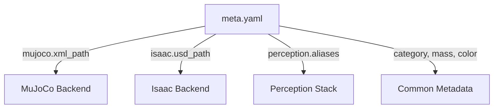

# 🧠 Asset Manager
*A unified, simulator-agnostic registry for robotics assets.*

Robotics projects often need to reuse the same physical assets — like cups, plates, and tools — across **multiple simulators, perception pipelines, and learning policies**.  
Managing these assets in each system separately leads to duplication, inconsistent metadata, and synchronization errors.

The **Asset Manager** provides a single source of truth for all object definitions, simulator-specific files, and perception aliases.

---

## 🎯 Motivation

| Challenge | Solution |
|------------|-----------|
| MuJoCo, Isaac, and Perception each store their own asset definitions | Use a single YAML registry to describe every object once |
| Each simulator needs paths, colors, or scaling in different formats | Define them under namespaced sections (`mujoco:`, `isaac:`, etc.) |
| Perception may call the same object by multiple names | Add module-specific aliases under `perception:` |

---

## 🧩 Design Principles

1. **YAML-first** — all data stored as simple text files, easily versioned in Git.  
2. **Simulator-agnostic** — supports any backend (`mujoco`, `isaac`, `ros`, `gazebo`, `urdf`).  
3. **Module extensibility** — new keys (like `policy`, `rendering`, etc.) can be added freely.  
4. **Immutable schema, flexible semantics** — top-level fields are human-readable and directly parsed.  
5. **Minimal dependencies** — just `PyYAML`.

---

## ⚙️ Example Schema (`meta.yaml`)

```yaml
name: cup
category: [kitchenware]
mass: 0.2
color: [0.8, 0.2, 0.2]
mujoco:
  xml_path: mujoco_cup.xml
isaac:
  usd_path: cup.usd
perception:
  ycb:
    aliases: ["cup", "red cup", "drinking vessel"]
  coco:
    aliases: ["cup", "mug"]
```

---

## 🚀 Quickstart

```bash
uv venv
source .venv/bin/activate
uv pip install -e .
python demos/demo_summary.py
```

Example output:
```
[AssetManager] Loaded 4 assets from data/objects
  - bowl       | kitchenware        | MJ: mujoco_bowl.xml | Isaac: bowl.usd
  - cup        | kitchenware        | MJ: mujoco_cup.xml  | Isaac: cup.usd
  - knife      | utensil            | MJ: mujoco_knife.xml | Isaac: knife.usd
  - plate      | kitchenware        | MJ: mujoco_plate.xml | Isaac: plate.usd
Modules: ['isaac', 'mujoco', 'perception:ycb']
Cup MuJoCo path: data/objects/cup/mujoco_cup.xml
```

---

## 🧠 Example Queries

```python
from asset_manager.manager import AssetManager
am = AssetManager("data/objects")

# List all assets
print(am.list())

# Filter by category
print(am.by_category("kitchenware"))

# Get simulator-specific file path
print(am.get_path("cup", "mujoco"))

# Resolve perception alias
print(am.resolve_alias("red cup", module="ycb"))
```

---

## 🏗️ Integration

| Module | Use Case |
|---------|-----------|
| **MuJoCo / Isaac** | Environment or ObjectRegistry loads geometry paths |
| **Perception** | Maps recognition labels → canonical asset names |
| **Policy / Learning** | Associates trained policies with real or simulated assets |
| **Planning / Simulation** | Ensures consistency of object IDs and mass properties |

---

## 🧩 Architecture Diagram



---

## 📦 Directory Layout

```
asset_manager/
├── src/asset_manager/manager.py
├── data/
│   └── objects/
│       ├── cup/
│       ├── bowl/
│       ├── plate/
│       └── knife/
└── demos/demo_summary.py
```

---

## 🧑‍💻 Authors

Developed by **Siddhartha Srinivasa**  
Personal Robotics Lab, University of Washington
